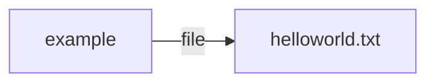
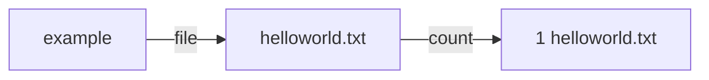
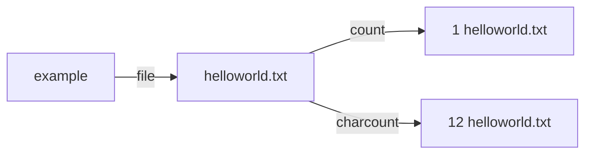
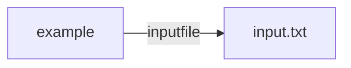
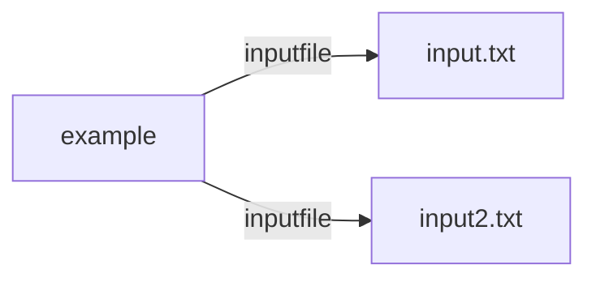
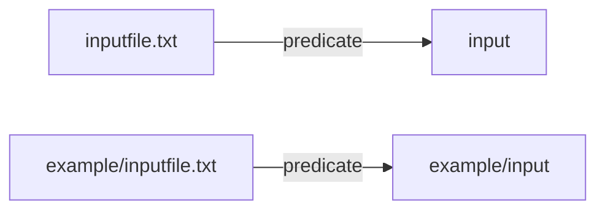

# Moirai2

## Introduction

MOIRAI2 is a very simple [scientific workflow system](https://en.wikipedia.org/wiki/Scientific_workflow_system) written in basic perl whith was developed with four concepts in mind:

- usability - Can execute workflow from a command line or from web page.
- reprodusibility - Just by adding options (-c), can execute with singularity/Docker container.
- scalability - Easy to expand computational power using virtual environment like [Hokusa-Sailing Ship](https://i.riken.jp/en/data-sci/).
- flexibility - Workflow processes are loosly connected with [semantic triples](https://en.wikipedia.org/wiki/Semantic_triple)

Let's me explain these concepts with examples:

> perl moirai2.pl exec ls -lt

This will simply execute 'ls -lt' command and store stdout output, time of executions, and command line information in [a log file](example/log/e20220424224043Mbqj.txt) under .moirai2/log directory.

> perl moirai2.pl -c ubuntu exec uname -a

This will execute uname command within ubuntu Docker container environment [a log file](example/log/e20220525005201M7M6.txt).

> perl moirai2.pl -a 192.168.1.12 -c ubuntu exec uname -a

This will execute uname command within ubuntu Docker container environment at 192.168.1.12 server (through SSH).

> perl moirai2.pl -a 192.168.1.12 -q openstack -c exec ubuntu uname -a

This will execute uname command within ubuntu Docker container environment at 192.168.1.12 server (through SSH) after creating a new (default) instance using [OpenStack](https://www.openstack.org).

By adding options to a command line, user can easily run same command line in different servers, but with the same computational environment (ubuntu Docker enrivonment).

Next, let's me explain how a workflow is handled by MOIRAI2 with examples.

> perl moirai2.pl -o 'example->file->$output' exec 'echo hello world > $output'



This will execute a command 'echo hello world > $output' and create an [output file](example/text/output) with a content "hello world" with a [log file](example/log/e20220424224158meiw.txt) with execution information.  It will also record a simple triple (subject=example, predicate=file, and object=filepath to output) in text based [database file](example/db/file.txt) (predicate is recorded as a basename of a file).

Reason why 'echo hello world > $output'
is quoted with a single quote (') is because a command contains redirect (>) and variable with dollar sign.  If a command line is not quoted, redirect to a file will be handled by the unix system and not by moirai2 system.  A single quote (') is used instead of double quote ("), because a variable quoted with double quote (") will be replaced by the value by unix system before passing to moirai2.  Single quote is recommended for wrapping a command line passed to moirai2 because of this reason.  If you want to use double quote ("), you can escape $'' with '\' like "echo hello world > \$output".

> perl moirai2.pl -i 'example->file->$input' -o '$input->count->$count' exec 'wc -l $input > $count'



Using an output file with content 'hello world' from the previous execution, moirai2 will execute a word count (wc) command and store its result in $output file.   An [output file](example/text/count), a [log file](example/log/e20220424224235CQWg.txt) and a metadata [triple file](example/db/count.txt) (subject=filepath to hello world text file, predicate=count, object=1) will be created.  Moirai2 checks for output triple before executing a command line.  If an output triple is found (meaning it's been executed before), wc process will not be executed.

> perl moirai2.pl -i '$input->count->$count' -o '$input->charcount->$count' exec 'wc -c $input > $count'



An [output file](example/text/charcount), a [log file](example/log/e202205171203279pKn.txt) and a metadata [triple file](example/db/charcount.txt) (subject=filepath to hello world text file, predicate=count, object=1) will be created.  Chain of commands can be connected by linking in/out triples like example above.  This is how moirai2.pl handles a scientific workflow.  Processes are loosely linked by triples which gives flexibility to a workflow, since a triple can be edited by user directly (text edit), or through web interface (php or flask), or through moirai computation (daemon).

## Structure
```
moirai2/
├── Dockerfile - a docker file of moirai2.
├── README.md - This readme file
├── command/ - a collection of command line files.
├── css/ - stylesheet used by jquery columns.
├── docker-compose.yml - docker-compose to run moirai2 web site.
├── example/ - a collection of example files
├── flask/ - files used for running web server through docker-compose
├── images/ - images used by jquery columns.
├── js/ - Javascript used for MOIRAI2 manipulation through a browser.
│   ├── ah3q/ - my javascripts fro moirai2
│   ├── jquery/ - jquery (https://visjs.org) scripts
│   └── vis/ - vis (https://visjs.org) scripts for network graphs
├── moirai2.php - Used for MOIRAI2 manipulation through a browser interface.
├── moirai2.pl - Assign and process MOIRAI2 commands.
├── openstack.pl - A collection of commands to run Openstack for moirai2.
└── rdf.pl - Script to handle a text-based triple (sub,pre,obj) database.
```

## Install

Use git command to clone project to your computer.
git is preinstalled in MacOS.
For Linux, you can install through 'apt-get'?
You can check the git by checking its version.

```
git --version
```

To install moirai2 to a directory named "project".

```shell
$ git clone https://github.com/moirai2/moirai2.git project
```

## Description

### moirai2.pl

```
Commands:
         build  Build a command json from command lines and script files
   clear/clean  Clean all command log and history by removing .moirai2 directory
       command  Execute user specified command from STDIN
        daemon  Checks and runs the submitted and automated scripts/jobs
         error  Check error logs
          exec  Execute user specified command from ARGUMENTS
          html  Output HTML files of command/logs/database
       history  List up executed commands
            ls  Create triples from directories/files and show or store them in triple database
           log  Print out logs information of processes
          open  Open .moirai2 directory (for Mac only)
     newdaemon  Setup a new daemon specified server
     openstack  Use openstack.pl to create new instance to process jobs
      sortsubs  For reorganizing this script(test commands)
        submit  Submit job with command URL and parameters specified in STDIN
          test  For development purpose (test commands)
```

#### Work directory
With each execution of process, a work directory is created under .moirai2/ with 'YYYYMMDDhhmmssXXXX' format where YYYY is year, MM is month, DD, is day, hh is hour, mm is minute, ss is second, and XXXX is a random character (for example, a directory path will be '.moirai2/e20220424202838b86T/').  'YYYYMMDDhhmmssXXXX' is also used as an execute ID (execid) of the process too.

These files will be created under work directory:
- log.txt - a file to keep command, input, output, and time information
- run.sh - a bash file used to run command
- status.txt - keep current status and timestamp
- stderr.txt - STDERR output from running command
- stdout.txt - STDOUT output from running command

These files will be deleted after execution and all the results will be summarized into one [log file](example/log/e20220424224235CQWg.txt) (example).

#### Summary File
A summary file is divided into these section:
- execid - a command URL, input and output parameters, and status.
- time - registered, start, end, and completed datetime
- insert/update/delete - edit log of triple database
- stdout - STDOUT of command if exists
- stderr - STDERR of command if exists
- bash - actual command lines used for processing

- If command is successful, a summary file 'YYYYMMDDhhmmssXXXX.txt' will be placed under '.moirai2/log/YYYYMMDD/' directory.

To view logs of execute IDs:

>perl moirai2.pl history 

A summary log file can be viewed from a command line.

>perl moirai2.pl history EXECID

#### Error File

- If error occurs, a summary log file 'YYYYMMDDhhmmssXXXX.txt' will be placed under '.moirai2/error/' directory.

To view errors logs:

>perl moirai2.pl error

After viewing error logs, moirai2 will prompt 

> Do you want to delete all error logs [y/n]?

If the causes of error is fixed, be sure to delete these error logs.
Moirai2 will NOT execute an error command with same input parameters, unless error log files are removed from moirai2 error directory.

#### Temporary directory

> .moirai2/YYYYMMDDhhmmssXXXX/tmp/ => /tmp/YYYYMMDDhhmmssXXXX (symbolic link)

While processing a command line, a temporary directory (.moirai2/YYYYMMDDhhmmssXXXX/tmp/) is created under a work directory (.moirai2/YYYYMMDDhhmmssXXXX/).  This temporary directory (.moirai2/YYYYMMDDhhmmssXXXX/tmp/) is actually a symbolic link from /tmp/YYYYMMDDhhmmssXXXX.  A /tmp temporary directory is to reduce I/O traffic of a server network by outputing result to a local directory of each node.  Upon completion of a command, a symbolic link will be replaced by the actual directory (mv /tmp/YYYYMMDDhhmmssXXXX .moirai2/YYYYMMDDhhmmssXXXX/tmp/).

Temporary directory is automatically used to specify output variables.  For example, If you specify output variable like this:

> perl moirai2.pl -o output exec 'ls -lt > $output'

```
output=$tmpdir/output
ls -lt > $output
```
'output=$tmpdir/output' is automatically added before use's command 'ls -lt > $output'.
In case where user assigned output path in argument.

A path to temporary directory is stored under variable '$tmpdir'.  In the example below, temporary file is created under a temporary directory.

```
>perl moirai2.pl exec 'ls -lt > $tmpdir/temp.txt;wc -l $tmpdir/temp.txt;unlink $tmpdir/temp.txt'
      14 .moirai2/e20220601175158bfMO/tmp/temp.txt
```

#### Specifying Variable Values By Arguments

Variables can be assigned from arguments with "variable=value' statement.  This gets handy when you want to specify input/outpu filepaths.  In default mode, all output files will be kept under $tempdir, but if you want to to keep somewhere else, you can specify output path in argument like this:

> perl moirai2.pl exec 'ls -lt > $output;' output=output.txt

Basically this means at the end of processing, reassign output variable to "output.txt".  ';' is used to separate actual command line 'ls -lt > $output' and Moirai2 argument 'output=output.txt'.  Without ';', MOIRAI2 can't distinguish it's a BASH code or MOIRAI2 code.  You can see that output variable is replaced by output.txt in [log file](example/log/e20220517112019ajb_.txt):

```
execid="e20220517112019ajb_"
tmpdir=".moirai2/e20220517112019ajb_/tmp"
output=$tmpdir/output # <= this assignment is default
mkdir -p /tmp/$execid
ln -s /tmp/$execid $tmpdir
ls -lt > $output
mv $output output.txt # <= this is automatically generated by MOIRAI2 if output is declared by the user
output=output.txt # <= this is automatically generated by MOIRAI2  if output is declared by the user
```

If you want to specify multiple output variables, you can simply add more arguments like following:

> perl moirai2.pl exec 'ls -lt > $output;wc -l $output>$output2;' output=output.txt output2=output2.txt

This will create a bash like below ([log file](example/log/e20220517112938cvz5.txt)):

```
execid="e20220517112938cvz5"
tmpdir=".moirai2/e20220517112938cvz5/tmp"
output=$tmpdir/output
output2=$tmpdir/output2
mkdir -p /tmp/$execid
ln -s /tmp/$execid $tmpdir
ls -lt > $output;wc -l $output>$output2
mv $output output.txt
output=output.txt
mv $output2 output2.txt
output2=output2.txt
```

#### Command Mode

If you want to process multiple command lines, use 'command' mode.  This will take in multiple command lines from STDIN.  For example:

```
perl moirai2.pl command << 'EOF'
ls -lt > $tmpdir/output.txt
wc -l $tmpdir/output.txt > output.txt
rm $tmpdir/output.txt
EOF
```

Make sure you use single quoted End Of File marker 'EOF', since usually command lines will contain '$' to represent variables.  By using single quoted EOF, '$' variables defined in command lines will not be processed by UNIX and will be passed as '$' variables to Moirai2 system.  '$tmpdir' is a system variable to use a temporary directory explained in previous section ([log file](example/log/e20220517114031V3Wl.txt)).

If you want to specify arguments in a command mode, syntax will be something like this ([log file](example/log/e20220517114255Hu7i.txt)):

```
perl moirai2.pl command 'output=worldcount.txt' << 'EOF'
ls -lt > $tmpdir/output.txt
wc -l $tmpdir/output.txt > $output
rm $tmpdir/output.txt
EOF
```

#### Input/Output Triples

MOIRAI2 uses [semantic triple](https://en.wikipedia.org/wiki/Semantic_triple) to link between command lines to construct a [scientific workflow](https://en.wikipedia.org/wiki/Scientific_workflow_system) (as explained in Introduction section).

```
> perl moirai2.pl -o 'example->file->$output' exec 'echo hello world > $output'
> perl moirai2.pl -i 'example->file->$input' -o '$input->count->$count' exec 'wc -l $input > $count'
> perl moirai2.pl -i '$input->count->$count' -o '$input->charcount->$count' exec 'wc -c $input > $count'
```

A triple network created by this example looks like this:


It is possible to walk through multiple triples by sharing the same variable name.  If you want to access root(example) and charcount, use $file to connect both triple. For example:

```
> perl moirai2.pl -i '$id->file->$file,$file->count->$path1,$file->charcount->$path2' exec 'echo $id charcount results are $path1 and $path2'

example charcount results are .moirai2/e20220523160029WyQX/tmp/count and .moirai2/e20220523160029WyQX/tmp/count
```

Walkint through the triple branches will become useful when processing STAR alignment.
For example, a triple network for STAR alignment:


Command for STAR alignment:

```
> perl moirai2.pl -i '$library->input1->$input1,$library->input2->$input2,$library->species->$species,$species->latestAssembly->$assembly,$assembly->starIndex->$genomdir' -o '$library->result->$outdir' exec 'STAR --runThreadN 4 --genomeDir $genomdir --readFilesIn $input1 $input2 --outFileNamePrefix $outdir;' 'outdir=/home/ah3q/data/$library/'
```

After successful processing, a result triple will be added to a network.


Strength of triple notation is flexibility.  For example, libraries with mixed species (human and mouse) can be handles with a single command line explained in previous example.


If you want to process differently, replace variable with the actual value (Homo_sapiens or Mus_musculus).

```
> perl moirai2.pl -i '$library->input1->$input1,$library->input2->$input2,$library->species->Homo_sapiens,Homo_sapiens->latestAssembly->$assembly,$assembly->starIndex->$genomdir' -o '$library->result->$outdir' exec 'STAR --runThreadN 4 --genomeDir $genomdir --readFilesIn $input1 $input2 --outFileNamePrefix $outdir;' 'outdir=/home/ah3q/humanData/$library/'

> perl moirai2.pl -i '$library->input1->$input1,$library->input2->$input2,$library->species->Mus_musculus,Mus_musculus->latestAssembly->$assembly,$assembly->starIndex->$genomdir' -o '$library->result->$outdir' exec 'STAR --runThreadN 4 --genomeDir $genomdir --readFilesIn $input1 $input2 --outFileNamePrefix $outdir;' 'outdir=/home/ah3q/mouseData/$library/'
```

By specifying Homo_sapiens for $species variable in first line will handle only Homo sapiens inputs (libraryB).  The second line specifies Mus_musculus for $species, so only Mus musculus input will be handles (libraryC).  After processing, network might look like this:


#### Input Array

Let's say we have three triples pointing to three files "hello.txt", "world.txt", "akira.txt" with predicate=file.


If triple 'example->file->$input' is used to execute command, variable $input will be assigned three times.  Which means commands will be executed three times.

```
> perl moirai2.pl -i 'example->file->$input' exec 'ls -lt $input'
[1] ls -lt hello.txt
[2] ls -lt world.txt
[3] ls -lt akira.txt
```

If you want to retrieve all files in one array and execute in one command line, use parenthesis () around the variable of triple.  Retrieved data will be assigned as BASH array.  To access array data, use [BASH array notation](https://opensource.com/article/18/5/you-dont-know-bash-intro-bash-arrays).

```
> perl moirai2.pl -i 'example->file->($input)' exec 'ls -lt ${input[@]}'

input=("akira.txt" "hasegawa.txt" "moirai2.txt")
ls -lt akira.txt hasegawa.txt moirai2.txt

> perl moirai2.pl -i 'example->file->($input)' exec 'ls -lt ${input[0]}'

ls -lt akira.txt

> perl moirai2.pl -i 'example->file->($input)' exec 'ls -lt ${input[1]}'

ls -lt hasegawa.txt

> perl moirai2.pl -i 'example->file->($input)' exec 'ls -lt ${input[2]}'

ls -lt moirai2.txt

> perl moirai2.pl -d test -i 'example->input->($input)' command << 'EOF'
for i in ${input[@]}; do
  ls -lt  $i
done
EOF

ls -lt akira.txt
ls -lt hasegawa.txt
ls -lt moirai2.txt
```

#### Output Array

There are cases where you want to use array for output.  You can just use BASH array notation and MOIRAI2 will take care of the rest.  For example:

```
perl moirai2.pl -o 'name->test->$output' exec 'output=("Akira" "Ben" "Chris" "David");'
```

These four entries will be added to a triple database.
  * name->test->Akira
  * name->test->Ben
  * name->test->Chris
  * name->test->David

This output array will be useful in bioinformatics when files are splitted by barcodes, for example:

```
perl moirai2.pl -o '$input->split->$split' << 'EOF'
outdir=$tempdir/out
splitByBarcode.pl -o $outdir $input
split=(`ls $outdir`)
EOF
```

Let assume splitByBarcode.pl takes in input.fq and split by barcodes and write files (e.g. ATCG.fq AACG.fq CGAA.fq TTAC.fq) to $outdir.
Filepaths are stored to $split variable with "split=(`ls $outdir`)" and four entries will be added to a triple database with "-o '$input->split->$split'".
  * input.fq->split->ATCG.fq
  * input.fq->split->AACG.fq
  * input.fq->split->CGAA.fq
  * input.fq->split->TTAC.fq

#### Running with Singularity/Docker

By adding -c option to a command, Moirai2 can execute command lines on Singularity/Docker environment as explained in Introduction section.

```
#Running with Docker
perl moirai2.pl -c ubuntu exec uname -a
#Running with Singularity
perl moirai2.pl -c ubuntu.sif exec uname -a
```

When running with Docker container, make sure specified image exists.  You can check list of Docker images by:

> docker images

If the container name ends with ".sif" file extension, Moirai2 will try to look for the Singularity Image File (SIF) filepath specified by the user.  SIF file can be under directory.  In this case:

```
perl moirai2.pl -c singularity/ubuntu.sif exec uname -a
```

In both cases, command will be executed with root user and directory where moirai2 is executed will be mounted to /root.  Following command lines is automatically generated and executed within MOIRAI2.
  * $container is "ubuntu" for Docker and "ubuntu.sif" for Singularity.
  * $bashfile is an execution code.

```
singularity \
  --silent \
  exec \
  --workdir=/root \
  --bind=$rootdir:/root \
  $container \
  /bin/bash $bashfile \
  > $stdoutfile \
  2> $stderrfile
```

```
docker \
  run \
  --rm \
  --workdir=/root \
  -v '$rootdir:/root' \
  $container \
  /bin/bash $bashfile \
  > $stdoutfile \
  2> $stderrfile
```

#### Running Command on Remote Server

By adding -a option to a command, user can execute a command at the remote server.  User doesn't have to worry about uploading/downloading files, since MOIRAI2 will take care of that:
  - Input files will be copied to ".moirai2remote/" of a remote server. 
  - Bash script generated by MOIRAI2 will be copied ".moirai2remote/" of a remote server.
  - A command will be executed through SSH connection.
  - Once command is completed, output files will be download to a local computer.
  - Input and output files will be deleted on a remote server.

  * You can specify server by servername or IP only, if you are sharing same username within you local and remote computers.
```
perl moirai2.pl -a moirai2.gsc.riken.jp exec uname -a
perl moirai2.pl -a 192.168.1.1 exec uname -a
```

  * You can also specify username and servername, if username are different among local and remote servers.  A work directory will be your home directory of a remote server.
```
perl moirai2.pl -a ah3q@moirai2.gsc.riken.jp exec uname -a
```

  * You can specify workdirectory with ":".  In example below, /home/ah3q/moirai2 will be used as a work directory of MOIRAI2.
```
perl moirai2.pl -a ah3q@moirai2.gsc.riken.jp:moirai2 exec uname -a
```

Example of input and output
```
echo "Hello World" > input.txt
perl moirai2.pl -a ah3q@moirai2.gsc.riken.jp:moirai2 exec 'wc -l input.txt > output.txt'
```

### rdf.pl
Script name is "rdf.pl" where RDF stands for "[resouce description framework](https://en.wikipedia.org/wiki/Resource_Description_Framework)".  But script doesn't not follow a strict RDF rules, but uses only the concept of triple semantics only.
moirai2.pl queries through rdf.pl when accessing triple database information.  Here is a command lines

```
Usage: perl rdf.pl [Options] COMMAND

Commands:    assign  Assign triple if sub+pre doesn't exist
             config  Load config setting to the database
             delete  Delete triple(s)
             export  export database content to moirai2.pl HTML from html()
             import  Import triple(s)
             insert  Insert triple(s)
             prompt  Prompt value from user if necessary
              query  Query with my original format (example: $a->B->$c)
             select  Select triple(s)
              split  split GTF and other files
               test  For development purpose
             update  Update triple(s)
```

#### Triple database
A rdf.pl's triple database is a very simple text-based database.
Triple informations are stored in a file with predicate as basename.
For example, example(subject)->inputfile(predicate)->input.txt(object) triple will be stored in a file "inputfile.txt" with subject and object separated by tab delim.



```
> cat inputfile.txt
example input.txt
```

If additional triple is added, for example, "example->inputfile->input2.txt", a content of "inputfile.txt" will look like this:



```
> cat inputfile.txt
example input.txt
example input2.txt
```

File content will be sorted alphabetically with each update.
This text-based triple databse is not meant to be used for a large-scale database.
This predicate text file can be gunzipped, if no additional update is necessary.
Meaning 'inputfile.txt.gz' is read only and rdf.pl can't write/update anymore.

#### Directory predicate
Normally predicate is defined with basename of a text file.  In case of 'inputfile.txt', predicate is 'inputfile'.  It's possible to have directory structure.  For example, in case of 'example/inputfile.txt', predicate will be 'example/inputfile'.



Also, predicate can be dirname of a directory.  For example. example/datacontent/ directory has two text files: "000.txt" and "001.txt".
```
example/datacontent/
├── 000.txt
└── 001.txt
```
It's possible to query all triples of 000.txt and 001.txt simply with "$key->example/datacontent->$value".
If you want to access 001.txt only, you can simply query with "$key->example/datacontent/001->$value".

#### Insert triple

If you want to insert new triple to database, use a command:
```
perl rdf.pl insert A B C
```
This will basically creates B.txt with a content "A\tC".

```
perl rdf.pl -d test insert A B C
```
By adding -d option to specify database root, new triple file "test/B.txt" will be created with a content "A\tC".  This is basically same as:

```
perl rdf.pl insert A test/B C
```

#### Accessing triples on the web http
Since the database are in text formats, you can upload those files to a public server and anyone will be able to access your database.

Theoretically, it'll be possible to merge multiple data on different servers into one by specifying predicate like example below.

```
perl rdf.pl A->https://aaa.bbb.ccc/ddd->B,B->https://eee.fff.ggg/hhh->C
```

#### gzipped file
Gzipped files can be read by the database.  For example, "input.txt.gz" can be read as "input" predicate by the triple database.  This gets handy when database becomes too big and want to save hard-disk spaces.  The down-side is query process will be slowed a bit, since program has to unzip.  Also program will not be able to insert/add new entries to that gunzipped predicate file.

#### Editing by hands

Since all the triple data are recorded in text files, user can easily edit database through common text editors.  Also by deleting a file, the whole predicate can be deleted too.  For example, if you delete "input.txt", a whole data where predicate is input will be deleted from the database.

### Web interface
#### moirai2.php
#### moirai2.js
#### flask docker-compose

### openstack.pl
#### Setup

### Daemon
>perl moirai2.pl daemon
Moirai2 can run in daemon mode where program checks for jobs in background and process when found.  Jobs can be assigned in two mode:
- crontab  moirai2 checks for updates in triple database and process jobs when applicable changes are found.  This is used for an automation of data production.
- submit  moirai2 checks for a text file under .moirai2/ctrl/submit directory.  A text file contains which command json to use and its parameters.  This is a gateway for a web interface.

#### crontab
```
perl moirai2.pl daemon crontab
```

By placing a bash file with input triple (root->input->$input) information in .moirai2/crontab/ directory, moirai2 periodically checks for new entry in predicate=input and process if found.

```
#$-i root->input->$input
#$-o $input->count->$count
output=`wc -l < $input`
```

Let's say we a file example.txt with just "Hello World", for example.
If a new triple 'root->input->example.txt' is added to the database (equivalent of 'root  example.txt' line is added to input.txt), moirai2.pl execute 'output=`wc -l < example.txt`' and stores the result in triple database 'example.txt->count->1' (equivalent of 'example.txt 1' in count.txt).

#### submit
```
perl moirai2.pl daemon submit
```

By placing a text file like example bellow under .moirai2/ctrl/submit/ directory, moirai2 will submit a new job using a command json file "example.json" and input parameter "example.txt".

```
url   example.json
input example.txt

>perl moirai2.pl daemon process
```

#### Jobs Across Internet

Processing of jobs are controlled by the existance of files under .moriai2/ctrl/job/ directory.  When a job is processed, a file will be transferred from .moirai2/ctrl/job/ to .moirai2/ctrl/process/ directory.  It is possible to share a .moriai2/ctrl/job/ directory across internet by specifying a username, server and directory with -j option like example bellow.  This will look for a file under  .moirai2/ctrl/job/ at 192.168.1.1 and if slot is available, a command file, input files, and parameters will be copied to the remote server and will be processed.  After the computation, output and logs will be copied back to the main server.

##### One server and multiple nodes
Main server takes care of crontab and submit, but no process.  Moirai directory will be created /home/ah3q/main/.moirai2/.  Nodes will look for a new job under /home/ah3q/main/.moirai2/ctrl/job at 192.168.1.1 server.

```
# main server
cd /home/ah3q/main
perl moirai2.pl daemon crontab submit
# Log in to node server1 (192.168.1.2)
perl moirai2.pl -j ah3q@192.168.1.1:main daemon processs
# Log in to node server2 (192.168.1.3)
perl moirai2.pl -j ah3q@192.168.1.1:main daemon processs
# Log in to node server3 (192.168.1.4)
perl moirai2.pl -j ah3q@192.168.1.1:main daemon processs
# Log in to node server4 (192.168.1.5)
perl moirai2.pl -j ah3q@192.168.1.1:main daemon processs
```

It's possible to deploy from main server in one bash script using -b option.  Make sure SSH keys are properly configured.

```
cd /home/ah3q/main
perl moirai2.pl daemon crontab submit
perl moirai2.pl -b ah3q@192.168.1.2 -j ah3q@192.168.1.1:main daemon processs
perl moirai2.pl -b ah3q@192.168.1.3 -j ah3q@192.168.1.1:main daemon processs
perl moirai2.pl -b ah3q@192.168.1.4 -j ah3q@192.168.1.1:main daemon processs
perl moirai2.pl -b ah3q@192.168.1.5 -j ah3q@192.168.1.1:main daemon processs
```

##### Nodes and Server Share Same Hard Disk

If the same hard disk are shaed by nodes and server, you can ommit -j option.  All the nodes will look for jobs under /home/ah3q/main/.moirai2 directory.

```
cd /home/ah3q/main
perl moirai2.pl daemon crontab submit
perl moirai2.pl -b ah3q@192.168.1.2:main daemon processs
perl moirai2.pl -b ah3q@192.168.1.3:main daemon processs
perl moirai2.pl -b ah3q@192.168.1.4:main daemon processs
perl moirai2.pl -b ah3q@192.168.1.5:main daemon processs
```

##### Openstack (Available soon)

As you know, Moirai2 can create a new instance of node through OpenStack.  By adding '-q openstack', when excessive jobs are found under job directory, new node will be created to process jobs.  And when not jobs are found, instances will be deleted.

```
cd /home/ah3q/main
perl moirai2.pl -q openstack daemon crontab submit process
```

## Licence

[MIT](https://github.com/tcnksm/tool/blob/master/LICENCE)

## Author

akira.hasegawa@riken.jp